# Artifact Teknis Opsifin Scheduler

| Metadata | Nilai |
| --- | --- |
| Dokumen | Arsitektur, desain, dan workflow teknis end-to-end |
| Sistem | Opsifin Scheduler |
| Versi artifact | 2.0 |
| Diperbarui | 10 September 2026 |
| Stack | Laravel 13, Filament 5, MySQL, Supervisor, cURL/Guzzle |
| Target eksekusi | Direct Bounded HTTP |
| Compatibility/rollback | Redis Queue dan Horizon |
| Timezone bisnis default | `Asia/Jakarta` |

Dokumen ini menjelaskan sistem dari konteks bisnis sampai proses, data, failure
semantics, keamanan, observability, deployment, dan source map. Source code
adalah sumber kebenaran implementasi. Cara memakai UI berada di
[Panduan Pengguna](user-guide.md), sedangkan operasi deployment direct berada di
[Direct HTTP Operations](direct-http-operations.md).

## 1. Executive summary

Opsifin Scheduler adalah control plane untuk menjalankan HTTP job terjadwal ke
banyak Client. Satu Task Template mendefinisikan request reusable; Schedule
menghubungkannya dengan Client serta timing; Run merepresentasikan satu
occurrence dan satu HTTP attempt.

Target runtime menggunakan satu daemon `jobs:work-direct` dengan rolling cURL
pool dan concurrency global terbatas. MySQL menyimpan pending work, lease,
ownership, hasil, dan histori. Redis/Horizon tetap tersedia selama compatibility
window untuk rollback, tetapi Run direct tidak dipublikasikan ke queue.

Prinsip desain:

- satu katalog job canonical, bukan template per Client;
- satu system cron, bukan cron per job/Client;
- materialization idempotent dan atomic claim;
- tepat satu HTTP attempt per Run;
- bounded concurrency dan bounded response memory;
- no automatic retry, no full catch-up, no resend outcome ambigu;
- result bisnis authoritative di MySQL Execution logs;
- credential di-redact sebelum preview atau persistence output.

## 2. Tujuan dan batas sistem

### 2.1 Tujuan

- Memusatkan cron/script HTTP ke konfigurasi yang dapat diaudit.
- Memakai satu definisi request untuk banyak Client.
- Menjadwalkan berdasarkan cron dan timezone tiap assignment.
- Menyediakan Run now, cancel sebelum start, dan histori hasil.
- Menjaga batas concurrency agar burst tidak membuat host tidak stabil.
- Mencegah duplicate occurrence dan overlap Schedule.
- Menyediakan health signal executor, dispatcher, slot, dan start lag.
- Mempertahankan jalur queue sementara untuk rollback release.

### 2.2 Non-goals

- Automatic retry HTTP atau replay seluruh downtime.
- Pembatalan paksa request yang sudah dikirim.
- Driver berbeda per Client/Task/Schedule.
- Distributed transaction MySQL–Redis.
- High availability multi-region bawaan.
- Blackout calendar, dependency graph, incident engine, atau watchdog luar.
- Menjamin idempotency endpoint Client.
- Mengaktifkan Schedule secara otomatis setelah import.

## 3. Technology stack

| Layer | Teknologi | Tanggung jawab |
| --- | --- | --- |
| Backend | PHP 8.3+ / Laravel 13 | Domain, scheduler, lifecycle, command |
| Admin UI | Filament 5 / Livewire | Configuration dan operations UI |
| Primary storage | MySQL | Source of truth, Run, lease, audit, session/cache |
| Direct transport | Guzzle + cURL multi | Rolling bounded HTTP pool |
| Process manager | Supervisor | Menjaga direct executor/Horizon |
| Scheduler clock | system cron | `artisan schedule:run` setiap menit |
| Queue compatibility | Redis + Horizon | Jalur queue dan rollback |
| Technical diagnostics | Telescope/log Laravel | Request web, command, exception |
| Frontend | Vite 8 / Tailwind CSS 4 | Asset panel |

## 4. System context

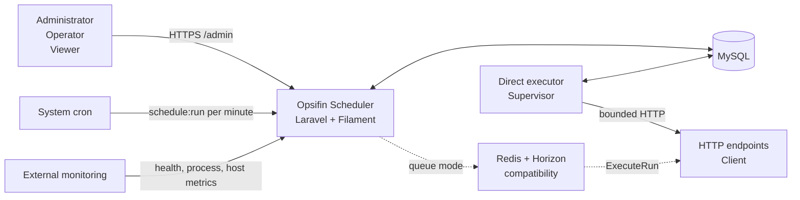

Trust boundaries:

- browser ke panel wajib HTTPS di production;
- MySQL dan Redis tidak diekspos ke internet;
- endpoint Client berada di luar transaction boundary aplikasi;
- backup DB sensitif karena Client credential disimpan sesuai input;
- external monitoring diperlukan untuk mendeteksi host mati total.

## 5. Container dan runtime topology

### 5.1 Direct target

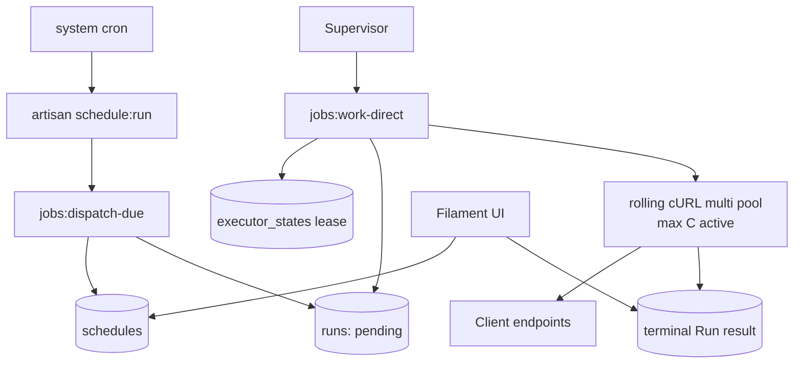

Komponen direct:

- `jobs:dispatch-due`: materialize occurrence dan heartbeat dispatcher;
- `jobs:work-direct`: daemon admission, lease, pool, heartbeat, dan drain;
- `RunExecutionLifecycle`: claim, validation, overlap, deadline, result;
- `DirectHttpTransport`: async request berbasis cURL/Guzzle;
- `BoundedResponseStream`: mengonsumsi response penuh, menyimpan prefix terbatas;
- `executor_states`: lease owner dan metrics snapshot.

### 5.2 Queue compatibility

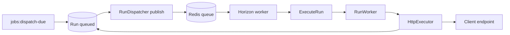

`queued_at`, `queue_job_id`, reconciler, Redis, dan Horizon dipertahankan selama
rollback window. Queue worker hanya claim `queued`; direct executor hanya claim
`pending` dengan `execution_driver=direct`.

### 5.3 Process ownership

Supervisor menjalankan satu active direct executor (`numprocs=1`). Bila daemon
kedua hidup, hanya pemilik lease database yang melakukan admission; daemon lain
standby. Lease memiliki heartbeat dan expiry sehingga takeover tidak membuat
dua pool aktif bersamaan.

## 6. Domain model

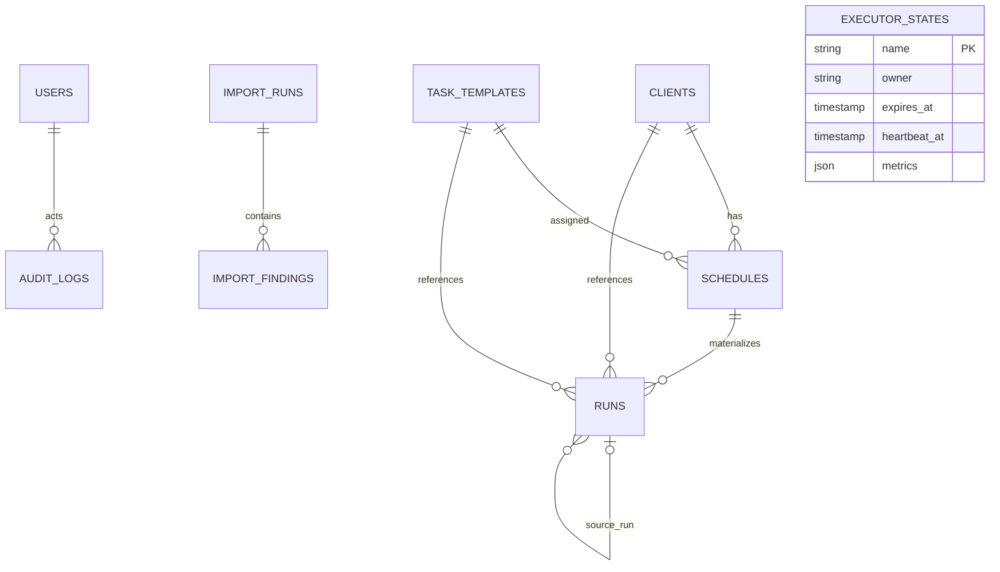

### 6.1 User

User memiliki role `admin`, `operator`, atau `viewer` dan state `is_active`.
Policy membedakan kemampuan manage dan operate. Password di-hash; avatar berada
di public storage.

### 6.2 Client

Menyimpan code, name, base URL, timezone, active state, auth type, username,
secret, secret key, serta metadata/review legacy. Deactivate adalah master switch
tanpa menghapus assignment atau histori.

### 6.3 Task Template

Menyimpan key, name, executor HTTP, method/path/body/headers, connect timeout,
request timeout, active state, default Schedule policy, dan metadata legacy.

Placeholder runtime:

```text
{{client.code}}
{{client.username}}
{{client.secret}}
{{client.password}}
{{client.secret_key}}
{{run.scheduled_for}}
```

### 6.4 Schedule

Menghubungkan Client dan Template melalui cron, timezone, enabled state,
`next_run_at`, queue compatibility, overlap flag, dan `running_run_id`.

Unique key: `client_id + task_template_id + cron_expression`.

Pause mengosongkan `next_run_at`; Resume menghitung occurrence berikutnya dari
sekarang. Beberapa timing diperbolehkan bila cron berbeda.

### 6.5 Run

Run menyimpan referensi domain, trigger, driver ownership, scheduled/prepared/
queued/started/finished time, start lag, deadline, worker, HTTP status, duration,
response excerpt, dan error. `materialization_key` mencegah occurrence terjadwal
ganda; `source_run_id` hanya digunakan retry queue compatibility.

### 6.6 Audit dan import

Audit Log merekam perubahan domain dengan actor dan before/after yang di-redact.
Import Run/Finding merekam migrasi legacy; import bukan runtime harian.

## 7. Peta module aplikasi

| Navigation | Resource | Tanggung jawab |
| --- | --- | --- |
| Dashboard | Widgets | Health, counts, lag, waiting Run |
| Insights / Client job summary | ClientSummaryResource | Coverage assignment/timing |
| Master data / Clients | ClientResource | Target dan credential |
| Master data / Task templates | TaskTemplateResource | Request canonical |
| Operations / Schedules | ScheduleResource | Assignment dan timing |
| Operations / Execution logs | RunResource | Outcome dan lifecycle Run |
| System / User management | UserResource | Akun/role |
| System / Audit history | AuditLogResource | Jejak perubahan |
| System / Telescope | AdminPanelProvider | Diagnostics admin |
| System / Horizon | Horizon provider | Queue-only diagnostics |
| Help / User guide | UserGuide page | Renderer Markdown read-only |

## 8. Configuration workflow

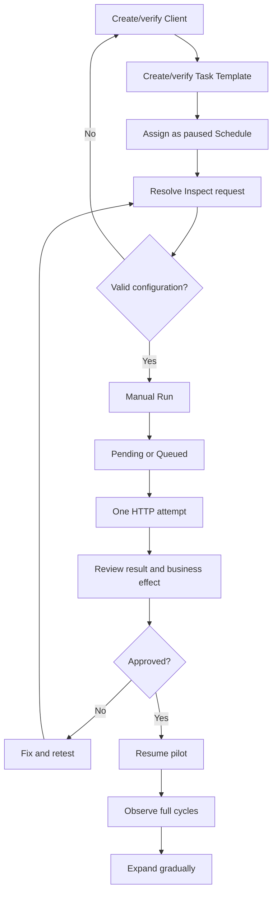

Assignment massal bersifat idempotent: pasangan existing tidak dibuat ulang dan
timing/state lama tidak diubah diam-diam. Assignment baru seharusnya paused.

## 9. Scheduling workflow

### 9.1 Scheduler registry

| Frekuensi | Command | Kondisi |
| --- | --- | --- |
| Setiap menit | `jobs:dispatch-due` | Selalu |
| Setiap menit | `jobs:reconcile-queued` | Driver queue |
| Setiap 5 menit | `horizon:snapshot` | Driver queue |
| 02:30 | `telescope:prune --hours=168` | Harian |
| 03:00 | `cron:purge-runs` | Harian |

System cron hanya memanggil `artisan schedule:run` setiap menit.

### 9.2 Dispatcher sequence

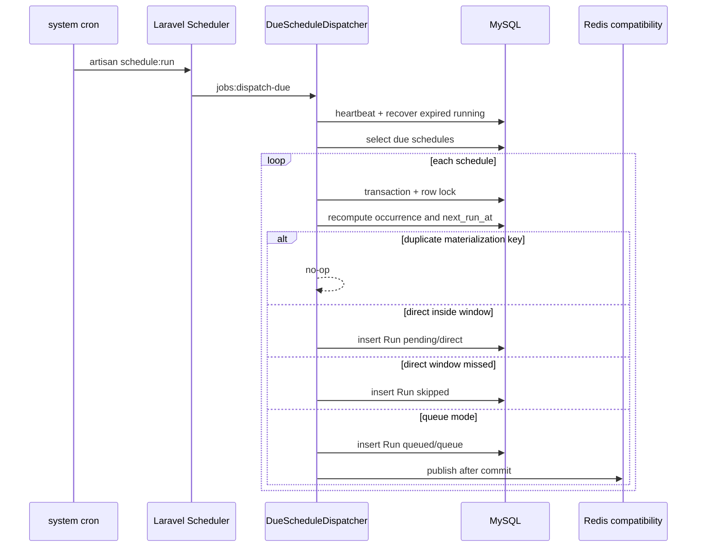

Dispatcher memilih occurrence terbaru, bukan replay seluruh downtime. Direct
yang terlambat menjadi `skipped` dan tidak di-catch-up.

## 10. Direct execution workflow

### 10.1 Admission dan rolling pool

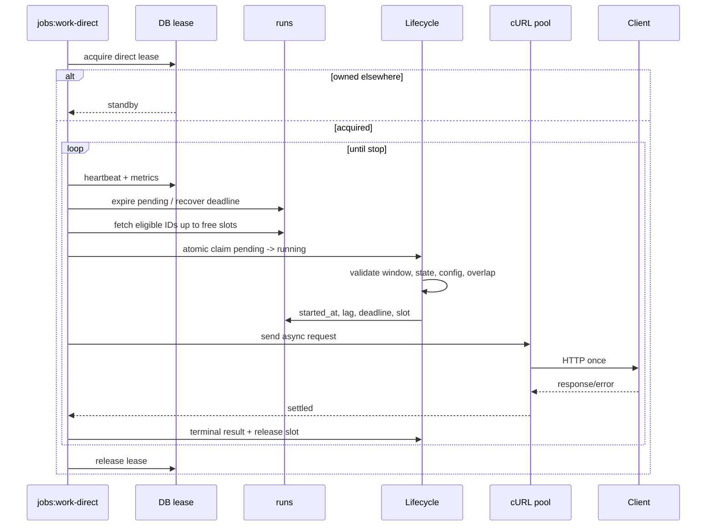

Pool mengisi slot yang selesai, termasuk Run now yang datang ketika request
lain aktif. Lifecycle memeriksa driver/status, start window, Client, Template,
Schedule otomatis, request resolution, dan overlap. Manual Run boleh berasal
dari Schedule paused, tetapi Client dan Template tetap harus aktif.

### 10.2 Bounded response

Response dikonsumsi sampai selesai/timeout, tetapi hanya prefix maksimum
`CRON_DIRECT_RESPONSE_MAX_BYTES` disimpan dalam memori. Excerpt DB dipotong oleh
`CRON_RESPONSE_EXCERPT_LENGTH` setelah redaction. Batas memori bukan bandwidth.

Redirect tidak diikuti. HTTP 2xx sukses; 3xx/4xx/5xx failed. JSON scalar
`message`/`error` dapat menjadi pesan hasil.

### 10.3 Shutdown dan crash

- **SIGTERM/SIGINT**: stop admission, drain in-flight, release lease.
- **SIGKILL/crash**: outcome ambigu; tunggu lease/deadline, failed tanpa resend.
- **Persistence failure**: stop admission; callback lain tetap diproses;
  unresolved running menunggu recovery.

## 11. Manual Run, cancel, dan retry

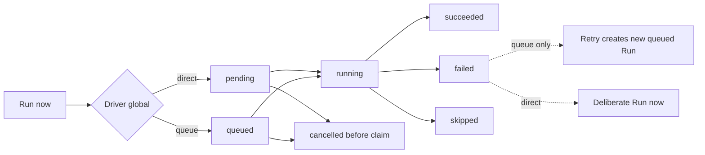

Cancel memakai row lock; queue juga mencoba menghapus payload. Race setelah
claim ditolak. Direct Retry tidak tersedia agar failure/outcome ambigu tidak
terkirim ulang tanpa keputusan operator.

## 12. Run state machines

### 12.1 Direct

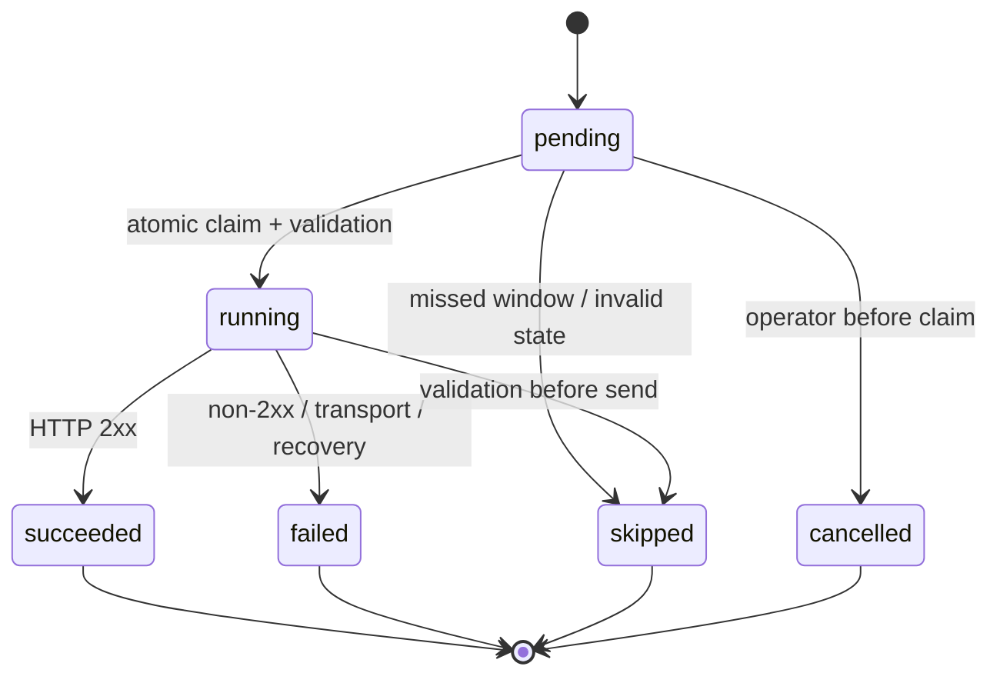

### 12.2 Queue compatibility

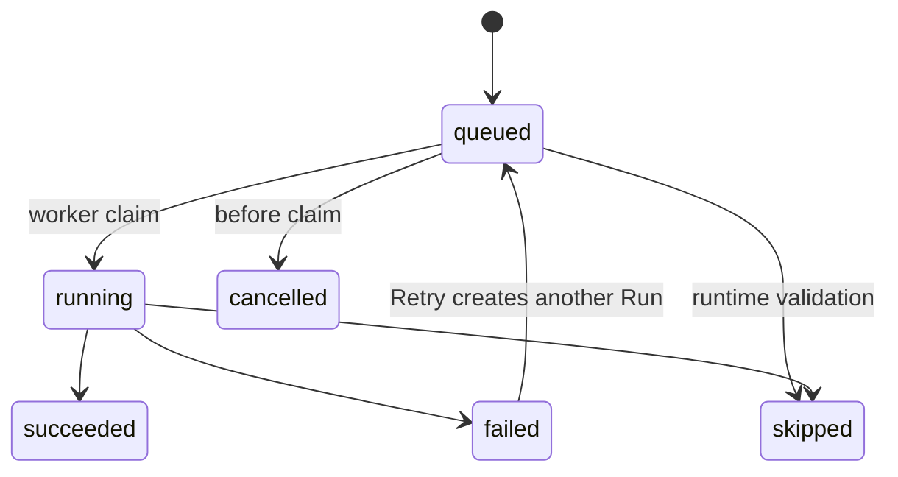

Terminal result hanya mengubah Run yang masih `running`; callback terlambat
setelah recovery menjadi no-op.

## 13. Concurrency dan capacity

```text
N = Run dalam burst
C = concurrency global
D = durasi endpoint representatif
W = start window

last_start ≈ (ceil(N / C) - 1) × D
syarat kasar: last_start < W
```

Model belum memasukkan DB latency, DNS/TLS, variasi endpoint, callback, dan
contention. Gunakan p95/p99 production. Validasi fixture 123×5 detik C=20 dan
246×5 detik C=40 ada di [Direct HTTP Validation](direct-http-validation.md) dan
bukan jaminan production.

## 14. Idempotency dan overlap

| Boundary | Mekanisme |
| --- | --- |
| Occurrence terjadwal ganda | Unique `materialization_key` |
| Claim oleh dua worker | Conditional status update |
| Satu active Run per Schedule | Atomic `running_run_id` |
| Callback terlambat | Update hanya saat running |
| Duplicate queue payload | Claim hanya dari queued |
| Crash direct | Deadline recovery tanpa resend |

Endpoint business idempotency tetap tanggung jawab pemilik endpoint.

## 15. Failure model

| Failure | Outcome | Recovery/operasi |
| --- | --- | --- |
| HTTP 4xx/5xx | Failed | Perbaiki; no auto retry |
| DNS/TLS/connect/timeout | Failed | Periksa transport/endpoint |
| Direct executor offline | Pending menua lalu skipped | Pulihkan Supervisor; tidak replay |
| Dispatcher offline | Tidak ada occurrence baru | Pulihkan system cron |
| Pool saturated | Start lag naik | Ukur latency/capacity atau kurangi scope |
| Previous Run aktif | Skipped | Tunggu Run lama |
| State/config invalid | Skip/fail sebelum send | Perbaiki state/config |
| SIGTERM | Drain | Supervisor restart normal |
| SIGKILL | Ambigu sampai deadline | Failed tanpa resend |
| DB persistence gagal | Admission berhenti | Pulihkan DB dan recovery |
| Queue publish gap | Queued tanpa payload | `jobs:reconcile-queued` |
| Redis/Horizon mati | Queue backlog | Queue runbook |

## 16. Security design

### 16.1 Authorization

Administrator mengelola master/configuration; Operator menjalankan operasi
harian; Viewer read-only. User nonaktif tidak dapat membuka panel.

### 16.2 Secret lifecycle

Credential Client disimpan plaintext/as-entered agar database dapat dipindahkan
tanpa `APP_KEY`. Karena itu DB/dump/backup adalah secret material. Model
menyembunyikan field, preview/result/audit me-redact, dan direct transport tidak
merekam outbound request ke Telescope. Redaction tetap bukan pengganti kontrol
akses.

### 16.3 Infrastructure

- HTTPS production; service process non-root.
- MySQL/Redis hanya localhost/private network.
- `.env`, logs, storage, dan backup berizin terbatas.
- Reverse proxy hanya dipercaya dari CIDR terkonfigurasi.

## 17. Observability

Execution logs menyimpan hasil bisnis; Audit history menyimpan perubahan.
`jobs:direct-status --json` dan Dashboard menyediakan heartbeat, counts,
active/capacity, saturation, p50/p95/p99 lag/duration, oldest pending, expired,
failed rate, dan missed window.

| Sumber | Isi |
| --- | --- |
| Laravel log | Exception aplikasi/executor/import |
| Supervisor log | Lifecycle daemon |
| Scheduler log | system cron/dispatcher |
| Web server/PHP-FPM | Upstream/fatal |
| Telescope | Web request, command, exception |
| Horizon | Queue compatibility |
| OS metrics | CPU, RSS, FD/socket, disk, network |

External monitor harus mengecek host/process/DB/HTTPS dari luar VPS.

## 18. Deployment dan rollback

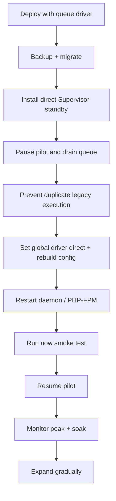

Rollback: Pause pilot, SIGTERM direct dan tunggu drain, ubah driver queue,
rebuild config, start Horizon, lalu Resume untuk occurrence berikutnya. Jangan
replay direct failure/ambiguous Run. Migration compatibility tidak perlu di-down.

## 19. Configuration reference

| Variable | Default | Arti |
| --- | ---: | --- |
| `CRON_EXECUTION_DRIVER` | `queue` | Global `queue`/`direct` |
| `CRON_DIRECT_CONCURRENCY` | 20 | Active HTTP maksimum |
| `CRON_DIRECT_BATCH_LIMIT` | 250 | Kandidat admission/once |
| `CRON_DIRECT_POLL_INTERVAL_MS` | 500 | Poll/recovery |
| `CRON_DIRECT_IDLE_DELAY_MS` | 500 | Delay pool kosong |
| `CRON_DIRECT_START_WINDOW_SEC` | 55 | Batas mulai, wajib <60 |
| `CRON_DIRECT_HEARTBEAT_SEC` | 15 | Lease heartbeat |
| `CRON_DIRECT_RESPONSE_MAX_BYTES` | 65536 | Prefix body memory |
| `CRON_RESPONSE_EXCERPT_LENGTH` | 2000 | Excerpt DB |
| `CRON_EXECUTION_MARGIN_SEC` | 60 | Deadline margin |
| `CRON_RUNS_RETENTION_DAYS` | 90 | Retensi terminal Run |

Default Task: connect timeout 10 detik dan request timeout 60 detik.

## 20. Retention dan backup

`cron:purge-runs` menghapus terminal Run melewati retention; waiting/running
tidak dihapus. Backup mencakup MySQL, `.env` terpisah, avatar storage,
web/cron/Supervisor/TLS config, dan release Git. Restore drill harus memeriksa
foreign keys, timestamps, credential, serta `executor_states`.

## 21. Testing strategy

| Layer | Fokus |
| --- | --- |
| Unit | Request resolution, redaction, DTO |
| Feature | Dispatcher, lifecycle, pool, UI policy/action |
| Real HTTP integration | timeout, disconnect, non-2xx, redirect, large body |
| Process drill | SIGTERM, SIGKILL, lease standby |
| Capacity opt-in | N × delay × concurrency |
| Static/build | Pint, Vite, `git diff --check` |

Hasil terdokumentasi: 120 tests, 447 assertions, satu capacity test opt-in
skipped pada suite normal. Test harus menetapkan `CRON_EXECUTION_DRIVER` secara
eksplisit agar tidak bergantung pada `.env` host.

## 22. Source code map

```text
# Entry points
routes/console.php
app/Console/Commands/{DispatchDueJobsCommand,WorkDirectRunsCommand,DirectExecutionStatusCommand}.php

# Scheduling dan lifecycle
app/Services/Scheduling/{DueScheduleDispatcher,RunDispatcher,RunExecutionLifecycle}.php
app/Services/Scheduling/{DirectPoolExecutor,DirectExecutorLease,DirectExecutionHealth}.php
app/Services/Scheduling/{QueuedRunCanceller,RunWorker}.php

# HTTP
app/Services/Execution/{HttpExecutor,DirectHttpTransport,BoundedResponseStream}.php
app/Services/Execution/Dto/{ResolvedRequest,RunExecution}.php

# Domain/UI
app/Models/{Client,TaskTemplate,Schedule,Run,AuditLog}.php
app/Enums/{RunStatus,RunTrigger,UserRole}.php
app/Policies/*.php
app/Filament/Resources/**
app/Filament/Widgets/**

# Config/deployment
config/opsifin_cron.php
database/migrations/2026_09_09_000001_prepare_runs_for_direct_execution.php
deploy/{vps,aapanel}/supervisor-direct-executor.conf.template
```

## 23. Definition of healthy

Direct sehat bila system cron berjalan tiap menit, executor/dispatcher online,
slot tidak melebihi capacity, pending tidak melewati window, p95 lag ≤45 detik,
p99 <60 detik, expired/missed window nol, failure rate sesuai baseline, dan host
mempunyai headroom.

Queue compatibility sehat bila Redis/Horizon/Supervisor hidup, backlog bergerak,
reconciler tidak menemukan gap berulang, dan timeout invariant terpenuhi.

## 24. Keputusan penting

1. Setelah cutover, database adalah source of truth; bukan script legacy.
2. Schedule import selalu paused.
3. Satu Run berarti satu attempt.
4. Manual resend harus disengaja dan memahami efek bisnis.
5. Concurrency ditetapkan dari latency/resource production.
6. Queue path dihapus melalui release terpisah setelah soak.
7. Status Run tidak diubah manual untuk memaksa replay.

## 25. Dokumen terkait

- [Panduan pengguna dan module](user-guide.md)
- [Arsitektur ringkas](architecture.md)
- [Direct deployment, operasi, rollback](direct-http-operations.md)
- [Direct validation](direct-http-validation.md)
- [Operations runbook](operations.md)
- [Production deployment](deployment-vps.md)
- [Development installation](installation.md)
- [Migration plan](direct-bounded-http-migration-plan.md)
- [Current handoff](handoff.md)
