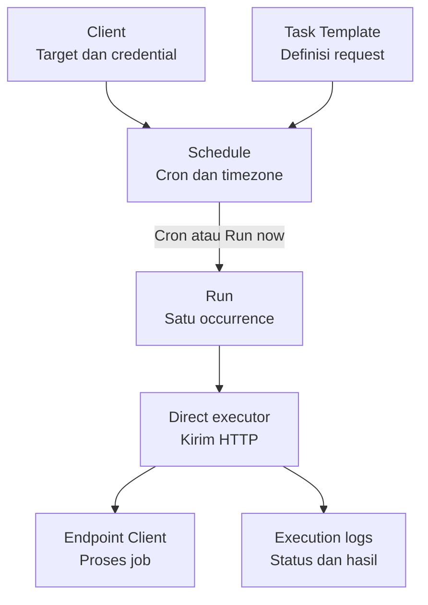
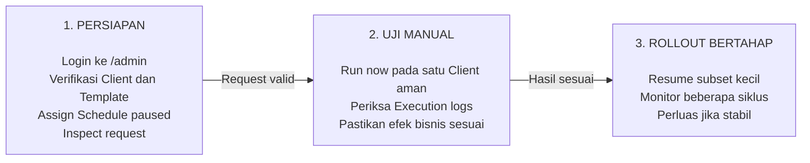

# Panduan Pengguna Opsifin Scheduler

| Metadata | Nilai |
| --- | --- |
| Audiens | Administrator, Operator, Viewer, PIC aplikasi |
| Cakupan | Seluruh module UI dan alur penggunaan end-to-end |
| Runtime utama | Direct Bounded HTTP |
| Runtime kompatibilitas | Redis Queue dan Horizon |
| Diperbarui | 10 September 2026 |

Panduan ini adalah pintu masuk dokumentasi penggunaan Opsifin Scheduler. Detail
setiap module dipisahkan ke file Markdown agar perubahan UI tidak mengharuskan
penyuntingan satu dokumen yang sangat panjang.

Panduan yang sama tersedia di panel melalui menu **Help → User guide**. Page
tersebut membaca file di `docs/` secara read-only; tidak ada salinan konten di
database. Diagram alur dirender sebagai visual SVG yang responsif dan mengikuti
mode terang atau gelap aplikasi.

## 1. Tentang aplikasi

Opsifin Scheduler adalah control plane untuk menjadwalkan dan menjalankan HTTP
job ke banyak Client. Job didefinisikan satu kali sebagai **Task Template**,
di-assign ke **Client** sebagai **Schedule**, lalu setiap occurrence dicatat
sebagai **Run** pada **Execution logs**.

Sistem menggantikan pola script dan cron Linux per Client. Hanya satu system
cron yang memanggil Laravel Scheduler setiap menit; jadwal bisnis disimpan di
MySQL dan dikelola melalui panel `/admin`.



## 2. Peta dokumentasi per module

| Area UI | Kegunaan | Panduan |
| --- | --- | --- |
| Dashboard | Kesehatan scheduler dan eksekusi | [Dashboard dan Insights](user-guide/01-dashboard-dan-insights.md) |
| Client job summary | Coverage job per Client | [Dashboard dan Insights](user-guide/01-dashboard-dan-insights.md) |
| Clients | Target URL, timezone, dan credential | [Clients](user-guide/02-clients.md) |
| Task templates | Definisi request HTTP reusable | [Task Templates](user-guide/03-task-templates.md) |
| Schedules | Assignment, cron, pause/resume, Run now | [Schedules](user-guide/04-schedules.md) |
| Execution logs | Status, hasil HTTP, cancel, dan diagnosis | [Execution Logs](user-guide/05-execution-logs.md) |
| User management | Akun dan role | [System dan Observability](user-guide/06-system-dan-observability.md) |
| Audit history | Jejak perubahan konfigurasi | [System dan Observability](user-guide/06-system-dan-observability.md) |
| Telescope/Horizon | Diagnosis teknis | [System dan Observability](user-guide/06-system-dan-observability.md) |
| Operasi harian | Checklist, gangguan, rollout aman | [Operasi Harian](user-guide/07-operasi-harian.md) |

Untuk implementasi internal, baca
[Artifact Teknis](artifact-teknis-opsifin-scheduler.md). Untuk deployment dan
rollback Direct HTTP, baca [Direct HTTP Operations](direct-http-operations.md).

## 3. Model mental

```text
Client + Task Template + cron/timezone = Schedule
Schedule + occurrence                    = Run
Run + execution driver                   = satu HTTP attempt
HTTP result                              = status dan detail di Execution logs
```

- **Client**: target sistem, base URL, timezone, dan credential.
- **Task Template**: method, path, headers, body, dan timeout request.
- **Schedule**: hubungan Client–Template beserta cron, timezone, state, dan
  overlap policy.
- **Run**: satu occurrence nyata, baik otomatis maupun manual.
- **Audit history**: siapa mengubah konfigurasi; bukan hasil HTTP.
- **Execution logs**: hasil bisnis eksekusi; bukan log framework.

Satu Task Template dapat dipakai banyak Client. Jangan menggandakan template
hanya karena URL atau credential Client berbeda.

## 4. Alur penggunaan end-to-end



Jika Inspect request belum benar, perbaiki Client atau Template sebelum Run now.
Jika uji manual gagal atau efek bisnis tidak sesuai, perbaiki konfigurasi/endpoint
dan ulangi inspeksi serta uji manual. Schedule baru tetap paused sampai verifikasi
selesai.

Urutan aman selalu **configure → inspect → manual smoke test → monitor →
resume bertahap**. Jangan langsung melakukan bulk Resume setelah membuat atau
mengubah konfigurasi.

## 5. Login dan akun

- Development: `http://opsifin-cron.local/admin`.
- Production: `https://<domain>/admin`.
- Login memakai email dan password.
- Akun dengan **Can sign in** nonaktif tidak dapat membuka panel.
- Gunakan menu profil untuk logout.
- Reset password tersedia dari halaman login bila email delivery telah
  dikonfigurasi; jika tidak, hubungi Administrator.

Jangan berbagi akun. Audit history menggunakan identitas user yang sedang login.

## 6. Role dan permission

| Kemampuan | Administrator | Operator | Viewer |
| --- | :---: | :---: | :---: |
| Melihat Dashboard dan seluruh data operasional | Ya | Ya | Ya |
| Membuat/mengubah/menghapus Client | Ya | Tidak | Tidak |
| Activate/Deactivate dan Test connection Client | Ya | Ya | Tidak |
| Membuat/mengubah Task Template | Ya | Tidak | Tidak |
| Assign/remove Template | Ya | Tidak | Tidak |
| Membuat/mengubah/menghapus Schedule | Ya | Tidak | Tidak |
| Pause/Resume Schedule | Ya | Ya | Tidak |
| Inspect request tersamarkan | Ya | Ya | Ya |
| Run now | Ya | Ya | Tidak |
| Cancel Run yang masih menunggu | Ya | Ya | Tidak |
| Retry failed Run queue | Ya | Ya | Tidak |
| User management | Ya | Tidak | Tidak |
| Audit history | Ya | Ya | Ya |
| Telescope | Ya | Tidak | Tidak |
| Horizon saat driver queue | Ya | Tidak | Tidak |

Jika tombol tidak muncul, periksa role dan status akun sebelum menganggap fitur
rusak.

## 7. Direct dan queue compatibility

UI menyesuaikan driver global yang aktif.

| Perilaku | Direct | Queue compatibility |
| --- | --- | --- |
| Status awal Run | `pending` | `queued` |
| Eksekutor | `jobs:work-direct` | Horizon worker |
| Concurrency | Pool global terbatas | Worker Horizon |
| Run now | Background, masuk `pending` | Background, masuk `queued` |
| Cancel | Selama masih `pending` | Selama masih `queued` dan payload belum diambil |
| Retry failed | Tidak tersedia; buat Run now baru setelah review | Tersedia untuk Run queue yang gagal |
| Batas start | Harus mulai dalam start window | Tidak memakai start window direct |

Perubahan driver adalah operasi deployment global, bukan pilihan per Schedule.

## 8. Status dan trigger Run

| Status | Arti | Tindakan umum |
| --- | --- | --- |
| Pending | Menunggu slot direct | Periksa executor, start lag, dan kapasitas |
| Queued | Menunggu worker queue | Periksa Horizon/Redis |
| Running | HTTP sedang diproses | Tunggu hasil/timeout; jangan kirim duplikat |
| Succeeded | HTTP 2xx | Tidak ada tindakan |
| Failed | Non-2xx, timeout, koneksi, atau exception | Baca detail dan perbaiki akar masalah |
| Skipped | Tidak dikirim karena window, overlap, pause, atau konfigurasi | Baca alasan; tidak ada replay otomatis |
| Cancelled | Dibatalkan sebelum mulai | Buat Run now baru hanya bila memang diperlukan |

Trigger: **Schedule** (cron), **Manual** (Run now), dan **Retry** (Run baru dari
failure queue compatibility).

## 9. Kontrol tabel yang umum

- **Search** mencari kolom utama dan judul kolom dapat dipakai untuk sort.
- **Filters** dapat tersimpan dalam session browser; gunakan **Reset filters**.
- Checkbox memilih record untuk bulk action. Baris terpilih disorot warna primary
  di seluruh lebarnya, sehingga tetap terlihat saat tabel lebar di-scroll ke samping.
- Menu **Actions** berisi aksi per record.
- Pagination membatasi record yang sedang terlihat.

Jika data terasa hilang, reset filter, kosongkan search, periksa pagination, lalu
refresh halaman.

## 10. Prinsip keselamatan

1. Buat Schedule baru dalam state paused.
2. Inspect request sebelum mengirim.
3. Run now hanya pada endpoint yang dipahami efeknya.
4. Jangan aktifkan legacy cron dan Schedule baru untuk occurrence yang sama.
5. Jangan retry request non-idempotent tanpa persetujuan pemilik proses bisnis.
6. Pause sebelum perubahan credential atau endpoint berisiko.
7. Jangan mengubah status Run atau `running_run_id` langsung di database.
8. Jangan menyalin credential, Authorization, `.env`, atau backup DB ke tiket.
9. Bulk Resume harus bertahap dan selalu diikuti monitoring.
10. Direct failure atau outcome ambigu tidak dikirim ulang otomatis.
11. Semua aksi yang mengubah atau menghapus data—termasuk tombol **Save** di
    halaman Edit dan ikon Enabled di tabel Schedules—meminta konfirmasi. Baca
    isi modal sebelum menyetujui.
12. Client hanya bisa dihapus setelah seluruh Schedule-nya dihapus; Schedule
    yang sedang running tidak bisa dihapus.

## 11. Quick start berdasarkan role

### Administrator

Verifikasi Client dan Template, buat assignment paused, Inspect request, lakukan
smoke test manual yang aman, lalu Resume subset dan monitor.

### Operator

Pastikan executor/dispatcher online, filter failure terbaru, Pause target yang
bermasalah, uji Run now setelah perbaikan, lalu Resume bertahap.

### Viewer

Pantau Dashboard, gunakan filter Execution logs, buka detail Run/Inspect request,
dan laporkan ID Run beserta status tanpa secret.

## 12. Dokumen terkait

- [Artifact teknis end-to-end](artifact-teknis-opsifin-scheduler.md)
- [Arsitektur ringkas](architecture.md)
- [Direct HTTP deployment dan rollback](direct-http-operations.md)
- [Direct HTTP validation](direct-http-validation.md)
- [Operations runbook](operations.md)
- [Development installation](installation.md)
- [Production deployment](deployment-vps.md)
