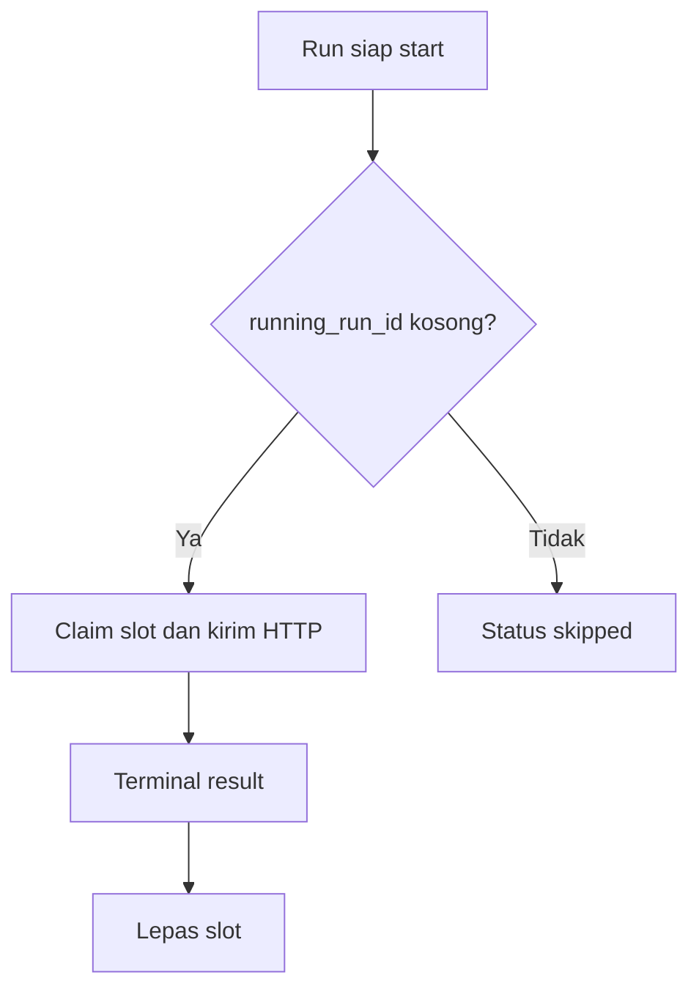

# Module Schedules

[Kembali ke panduan utama](../user-guide.md)

Menu: **Operations → Schedules**. Schedule menghubungkan satu Client, satu Task
Template, cron expression, timezone, state, dan overlap policy.

## Kolom dan filter

| Kolom | Arti |
| --- | --- |
| Client / Job | Target dan Template |
| Cron | Expression dan deskripsi manusia |
| Next run | Occurrence berikutnya; `Paused` bila disabled |
| Latest | Hasil Run terbaru |
| No overlap | Slot satu Run aktif per Schedule |
| Review | Perlu verifikasi |
| Enabled | State occurrence otomatis |

Filter: Client, Job, Enabled, dan Needs review. Tabel refresh tiap 30 detik.

## Membuat Schedule

1. Pilih **New schedule**.
2. Pilih Client dan Job template.
3. Isi quick preset atau cron lima bagian.
4. Pilih timezone bisnis yang benar.
5. Review lima occurrence berikutnya.
6. Aktifkan **Skip overlapping run** kecuali concurrency memang aman.
7. Simpan dalam state paused untuk rollout awal.

| Expression | Arti |
| --- | --- |
| `*/5 * * * *` | Setiap 5 menit |
| `0 * * * *` | Setiap awal jam |
| `0 6 * * *` | Setiap hari pukul 06:00 |
| `0 6 * * 1-5` | Senin–Jumat pukul 06:00 |

Kartu Migration trace (pattern, baris, dan command legacy) tidak ditampilkan
lagi di form; datanya tetap tersimpan.

Satu Client dapat memiliki beberapa timing untuk Template yang sama selama cron
expression berbeda.

## Inspect request

**Inspect request** me-resolve method, URL, headers, body, dan timeout tanpa
mengirim HTTP. Credential/header sensitif disamarkan. Semua role aktif dapat
memakai aksi read-only ini.

## Run now

1. Pastikan efek endpoint dipahami serta Client dan Template aktif.
2. Klik **Run now** dan konfirmasi.
3. Buka Execution logs dan cari ID Run yang dibuat.
4. Tunggu status terminal dan periksa efek bisnis.

Run now boleh digunakan saat Schedule paused. Pada direct status awalnya
`pending`; pada queue compatibility status awalnya `queued`.

## Pause dan Resume

- Pause mengubah `is_enabled=false` dan mengosongkan `next_run_at`.
- Resume menghitung occurrence berikutnya dari waktu sekarang.
- Waktu selama pause tidak di-replay.
- Pause tidak menghentikan request yang sudah running.

Mengklik ikon **Enabled** di tabel sekarang meminta konfirmasi Pause/Resume
sebelum state berubah.

Bulk Resume berdampak luas. Filter dan pilih subset yang tepat, periksa jumlah
pilihan, lalu monitor setelah konfirmasi.

## Set cron in bulk

Administrator dapat mengganti cron banyak Schedule. Timezone dapat diganti atau
dibiarkan memakai nilai masing-masing. Periksa preview waktu dan `next_run_at`.

## Overlap protection

Occurrence overlap tetap tercatat sebagai `skipped`, tetapi HTTP kedua tidak
dikirim. Slot bersifat atomik di database dan tidak bergantung pada file lock.

## Menghapus Schedule

Administrator dapat menghapus Schedule lewat **Delete** di menu aksi baris,
header halaman Edit, atau bulk **Delete selected**. Setiap penghapusan meminta
konfirmasi; modal memberi peringatan bila Schedule masih enabled.

- Schedule dengan Run yang sedang `running` tidak dapat dihapus; bulk delete
  melewatinya dan melaporkan jumlah yang dilewati.
- Riwayat Run tetap disimpan dengan kolom Schedule kosong.
- Run yang masih menunggu (`pending`/`queued`) otomatis di-skip oleh executor.
- Penghapusan tercatat di Audit history.

Pause lebih aman bila hanya ingin menghentikan eksekusi sementara.
